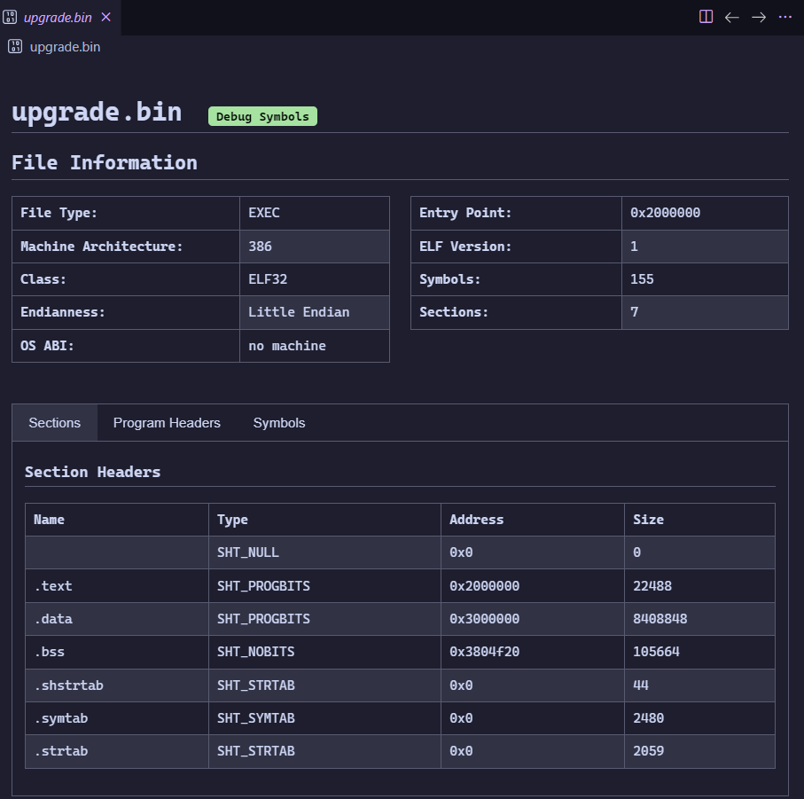

# elfpreview README

`elfpreview` is an editor extention in vscode that displays `readelf` like information about elf binaries.

The extention adds an aditional editor, similar to how a hex editor might work, which is used to display a clean table view of information about the currenly open file.

## Features

Describe specific features of your extension including screenshots of your extension in action. Image paths are relative to this README file.

> Tip: Many popular extensions utilize animations. This is an excellent way to show off your extension! We recommend short, focused animations that are easy to follow.

## Requirements

If you have any requirements or dependencies, add a section describing those and how to install and configure them.

## Extension Settings

Include if your extension adds any VS Code settings through the `contributes.configuration` extension point.

For example:

This extension contributes the following settings:

* `myExtension.enable`: Enable/disable this extension.
* `myExtension.thing`: Set to `blah` to do something.

## Known Issues

- Running `pnpm generate` results in typescript type error.  This is because `wit2ts` mixes up some types that need to be manually corrected.  I am unsure if this is a bug or a skill issue.

- Using the expected build target for rust, `wasm32-wasi` or `wasm32-wasip2` results in linker errors.  I am unsure why this is the case, or for that matter, why using a more generic target still works, but it does so :shrug:

## Release Notes

### 0.0.1

Initial release

---

## Following extension guidelines

Ensure that you've read through the extensions guidelines and follow the best practices for creating your extension.

* [Extension Guidelines](https://code.visualstudio.com/api/references/extension-guidelines)

