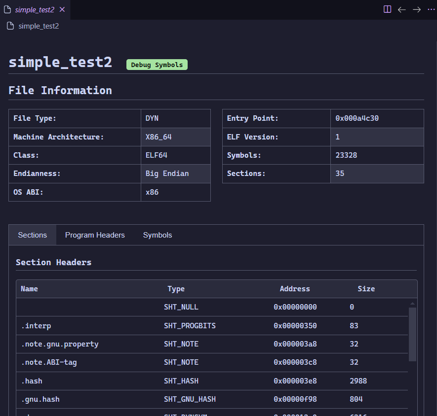

# elfpreview

A lightweight VS Code extension that provides d information about ELF files in a clean, no-frills webview-based interface. Combining features similar to `readelf` and `file`, it uses a modern stack to offer a fast and clean experience.

The extention adds an aditional editor, similar to how a hex editor might work, which is used to display a table view of information about the currenly open file.



## Table of Contents

- [Overview](#overview)
- [Features](#features)
- [Installation](#installation)
- [Usage](#usage)
- [Extension Settings](#extension-settings)
- [Known Issues](#known-issues)
- [Release Notes](#release-notes)
- [Background](#background)

## Overview

This extension is designed to analyze ELF files by:

- Extracting key information in a manner similar to traditional command line tools.

- Presenting a detailed webview with a simple, efficient UI built with Svelte 5.

- Efficiently handling large binaries and files with thousands of symbols.

It is implemented using a combination of Rust (via the [libgoblin](https://github.com/m4b/goblin) library running in WebAssembly) and TypeScript. Communication between the WebAssembly module and the extension is facilitated by WASI and [WIT types](https://component-model.bytecodealliance.org/design/wit.html), ensuring seamless type sharing and solid cross platform preformance.

## Features

- **Fast File Analysis**: Quickly loads and displays basic file information for instant feedback.

- **Detailed Parsing**: Processing of ELF binaries, even those with extensive symbols, done in the background to reduce felt lag.

- **No-Frills UI**: A straightforward, functional webview that just works, no unnecessary complexity.

- **Lightweight & Cross Platform**: At only a few hundred kb, the extension is snappy and works on macOS, Windows, Linux, and the web version of VS Code.

## Installation

1. **From the VS Code Marketplace:** Search for `elfpreview` in the Extensions view and install it directly

2. **Via VSIX:** Download the provided `.vsix` file from [elfpreview/releases](https://github.com/jlevere/elfpreview/releases) and install it by running

```bash
code --install-extension elfpreview-<release>.vsix
```

## Usage

There are two ways to activate the extention, with the [Context Menu](#context-menu) or [Editor Selection](#editor-selection).

### Context Menu

Simply right click on an elf binary and select `ELF: Show Preview`


### Editor Selection

This is the normal view when you open a non text file. Vscode does not support editor selection by file type, only file extension, so you get this window.


When you select open anyway, you are presented with another dialog option to select the editor you wish to open the file with. `elfpreview` should be listed as an option.


## Extension Settings

There are no settings for this extension

## Known Issues

- TypeScript Generation Error:

  Running `pnpm generate` results in typescript type error. This is because `wit2ts` mixes up some types that need to be manually corrected. I am unsure if this is a bug or a skill issue.

- Rust Build Target Warnings:

  Using the expected build target for rust, `wasm32-wasi` or `wasm32-wasip2` results in linker errors. I am unsure why this is the case, or for that matter, why using a more generic target still works, but it does so :shrug:

If you experence any other issues, please submit an issue here: [elfpreview/issues](https://github.com/jlevere/elfpreview/issues)

## Release Notes

### 0.1.1

Added more information about symbols

### 0.1.0

Initial release

## Background

How files are processed:

1. Initial Display: Upon opening an ELF file, the extension quickly presents basic information (similar to the output of file).

2. Background Processing: The heavy lifting is performed in the background:

   - The binary is read into WebAssembly.

   - The Rust-based parser (using libgoblin) processes the file.

   - Data is then incrementally populated into the webview.

3. Communication: Type sharing between TypeScript and WebAssembly is managed via WASI and WIT, with stubs generated using [Microsoft's wit2ts tool](https://github.com/microsoft/vscode-wasm/blob/main/wasm-component-model/bin/wit2ts).

## Tests

There are tests for the rust code located in the [lib.rs](./rust/src/lib.rs) file it self. The utilize a few test files in the [fixtures](./rust/tests/fixtures/) directory. Some of these test binaries were taken from [https://github.com/tmpout/elfs](https://github.com/tmpout/elfs), primarily made by [@netspooky](https://x.com/netspooky)

Some have strange architectures, some lots of headers, etc. The one that actually gave pause was a simple rust program compiled with symbols in a nix enviroment. Turns out it has several hundered symbols with massively long names which is a struggle to push through the ts wasm boundary and also just to display cleanly.
